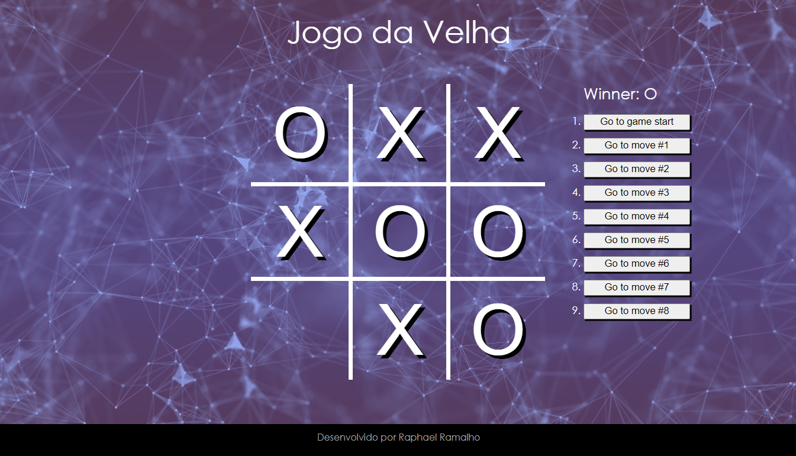

# 💻 Projeto

Jogo da Velha desenvolvido durante etapa técnica do programa de estágio Sky.One 2021.
  

## 🛠️ Construído com
<ul>
 <li>React.JS
 <li>Javascript
 <li>CSS3
 <li>HTML5
</ul>

## 📋 Etapas para execução do Jogo
<ul>
 <li>Execute o comando npm start
 <li>Divirta-se 😃
</ul>
 

⌨️ com 💜 por Raphael Ramalho 

